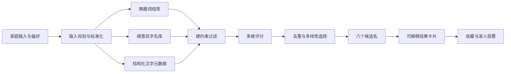

<p align="center">
  
</p>

<h1 align="center">予名</h1>

<p align="center"><strong>循典取意，因愿成名</strong></p>

<p align="center">
  一款为手机端打造的中文取名工具。以典籍语境、字义关系、普通话音律、字形书写与家庭偏好为线索，<br />
  为每一个候选名提供可追溯、可听读、可比较的完整解释。
</p>

<p align="center">
  
  
  
  
</p>

<p align="center">
  <a href="https://shadow-cd.github.io/"><strong>在线体验</strong></a>
  ·
  <a href="#产品预览">产品预览</a>
  ·
  <a href="#命名引擎">命名引擎</a>
  ·
  <a href="#本地运行">本地运行</a>
</p>

---

## 为什么是「予名」

名字需要经得起长期使用，而不只是第一眼好听。

「予名」从完整词组与可追溯语境出发，把一次取名拆解成三个可以理解、可以复核的目标：

| 可讲 | 可念 | 可久 |
| --- | --- | --- |
| 说得清名字从哪里来、每个字表达什么 | 结合姓氏检查拼音、声调、声母、韵母与连读节奏 | 兼顾书写密度、识读成本、重名倾向与家庭接受度 |

它不会只给出一个分数。每个候选名都会展开出处、逐字含义、整体寓意、音形评价、性别气质、使用提醒和综合结论，让家人知道为什么选，也知道还需要核对什么。

## 产品预览

<table>
  <tr>
    <td align="center"><strong>按家庭偏好配置条件</strong></td>
    <td align="center"><strong>阅读完整候选名报告</strong></td>
  </tr>
  <tr>
    <td></td>
    <td></td>
  </tr>
</table>

> 建议使用手机访问 [在线版本](https://shadow-cd.github.io/)，桌面端会保持移动设备宽度，便于还原真实操作节奏。

## 核心能力

| 能力 | 处理方式 | 结果呈现 |
| --- | --- | --- |
| **典籍诗词** | 优先从诗经、楚辞、唐宋诗文等完整词组和相邻意象中选名 | 标注作品、原句与取意，不只罗列单字出处 |
| **寓意与气质** | 综合平安、聪慧、远志、仁爱、自由、清雅等寄托，以及书卷气、清朗、温润、大气等风格 | 给出逐字释义、语义关系与整体寓意 |
| **普通话音律** | 结合姓氏分析全名拼音、声调起伏、声母与韵母区分、尾音收束 | 展示带声调拼音、调型和连读评价 |
| **字形书写** | 比较笔画总量、两字笔画差与视觉重心 | 提醒书写效率、结构密度和识读成本 |
| **公历与农历** | 支持两种历法选择，并将时间用于节气、生肖和传统四柱参考 | 在结果中解释采用的时间信息与传统文化依据 |
| **五行与周易** | 将五行偏向、节气和卦象作为可选的传统文化参考维度 | 明确提示其民俗属性，不作命运预测 |
| **家族字辈** | 可指定辈分用字及首字、末字位置 | 在保持字辈的前提下寻找语义与音律更协调的搭配 |
| **个性化约束** | 支持性别倾向、单字或双字、喜欢字、忌用字和地区复核偏好 | 锁定条件生成，并可持续“换一组” |
| **家庭协作** | 收藏候选名并汇总完整解释 | 一键生成并复制家人投票文案 |

## 命名引擎

### 生成链路



### 处理原则

1. **先校验输入**：姓氏必须为一至两个中文姓氏字符；生辰八字被选中时，出生时间必须完整。
2. **先词组、后单字**：双字名来自典籍词组库或经过整理的顺意组合，避免无关系的好字机械拼接。
3. **硬条件先过滤**：名字字数、性别倾向、字辈位置、忌用字和基础读音问题先于评分处理。
4. **多维度再排序**：综合典籍匹配、语义气质、五行参考、普通话音律、字形笔画、时令与个性偏好。
5. **保持结果差异**：候选名单会限制首字、尾字和字辈搭配的重复，“换一组”仍沿用已锁定条件。
6. **解释与结果同源**：出处、拼音、笔画、五行和提醒均由候选名自身数据生成，而不是套用固定文案。

### 结果报告

每个候选名包含以下信息：

- **名字综评**：一句话概括名字气质与核心寓意。
- **出处与取意**：典籍作品、原句语境及入名含义。
- **字义与寓意**：逐字拼音、声调、字义和整体寄托。
- **音形评价**：全名调型、音节边界、尾音和笔画结构。
- **性别气质**：描述日常语感中的倾向，不把性别作为硬性标签。
- **取名依据**：说明本次实际采用的条件及其匹配关系。
- **使用提醒**：重名倾向、识读成本、书写密度和连读复核建议。
- **综合结论**：总结优势、权衡点及适合的家庭偏好。

## 可信边界

取名同时涉及语言、文化传统和家庭情感。项目对不同能力的边界作如下约定：

- **隐私**：应用为纯前端静态页面，输入与生成过程在浏览器本地完成，不向服务器上传姓名或出生时间。
- **典籍**：内置条目会给出作品与原句；用于证件前，仍建议对照权威版本复核文字和上下文。
- **音律**：核心分析基于普通话。粤语、吴语、闽南语、四川话选项用于标记复核需求，不替代专业方言词典和母语者听读。
- **重名**：项目仅提供候选之间的相对常见度参考，不连接户籍人口数据库，实际情况应以当地可用查询为准。
- **传统文化**：五行、八字、生肖和周易属于民俗文化参考，不构成对性格、健康、学业或命运的预测。

## 技术设计

| 层级 | 实现 |
| --- | --- |
| 页面结构 | Semantic HTML5 |
| 视觉与响应式 | 原生 CSS、CSS Variables、移动端安全区适配 |
| 交互与命名逻辑 | Vanilla JavaScript |
| 农历显示 | `Intl.DateTimeFormat` Chinese Calendar |
| 数据存储 | 当前页面内存，不依赖后端数据库 |
| 构建流程 | 无构建步骤、无运行时依赖 |
| 部署 | GitHub Pages |

### 项目结构

```text
mingqi-mobile-web/
├── index.html                         # 予名页面结构
├── styles.css                        # 移动端视觉与组件样式
├── app.js                            # 命名数据、筛选、评分与交互逻辑
├── assets/
│   └── logo-yuming-icon.png          # 品牌图标
├── docs/screenshots/
│   ├── home-mobile.png               # 条件配置预览
│   └── results-mobile.png            # 结果报告预览
├── tests/
│   └── engine-smoke.cjs              # 命名引擎回归测试
└── spacex-landing-page/
    └── index.html                    # 独立的 SpaceX 概念页面
```

## 本地运行

项目没有安装依赖和构建步骤。

```bash
git clone https://github.com/cdlixuefeng-droid/mingqi-mobile-web.git
cd mingqi-mobile-web
python -m http.server 4173
```

浏览器访问 `http://127.0.0.1:4173/`。也可以直接打开 `index.html` 预览。

## 质量验证

```bash
# JavaScript 语法检查
node --check app.js

# 命名引擎回归测试
node tests/engine-smoke.cjs
```

回归测试覆盖男女与中性方向、复姓、典籍词组优先、双字语义完整性、拼音覆盖、音律过滤、字辈约束、公历默认日期以及结果文案结构。

## 后续方向

- 持续校勘典籍原文、版本差异与字词训诂。
- 引入可验证的方言发音语料，完善跨地区谐音检查。
- 增加候选名报告导出与更适合家庭讨论的分享样式。
- 建立移动端视觉回归和更多姓氏、音节边界测试。

## 反馈

发现出处、读音或交互问题，欢迎发送邮件至 [1411654789@qq.com](mailto:1411654789@qq.com)。

<p align="center">
  <strong>名字是长久的称呼，也是家人给出的第一份郑重祝愿。</strong>
</p>
